# ☸️ Kubernetes Resilient Microservice


> **"Systems fail. Reliable systems handle failure automatically."**

### 📖 About The Project

This repository demonstrates a **cloud-native approach** to deploying microservices. It implements a Python Flask application containerized with Docker and orchestrated via Kubernetes.

The core goal is to showcase **infrastructure resilience**:
1.  **High Availability:** Using multiple replicas to ensure the service survives if one instance crashes.
2.  **Self-Healing:** Implementing `LivenessProbes` so Kubernetes can automatically restart unresponsive containers.
3.  **Load Balancing:** Distributing traffic efficiently across healthy pods.

---

### 🏗️ Architecture Diagram

This diagram illustrates the high-availability setup and the self-healing mechanism powered by Kubernetes Liveness Probes.

```mermaid
graph TD
    %% Professional styling
    classDef k8s fill:#326ce5,stroke:#fff,stroke-width:2px,color:#fff;
    classDef container fill:#e1f5fe,stroke:#326ce5,color:#000;
    classDef external fill:#fff,stroke:#333,stroke-dasharray: 5 5,color:#000;

    %% External Actors
    User["👤 External User / Browser"]:::external
    
    %% Kubernetes Cluster Scope
    subgraph "☸️ Kubernetes Cluster"
        
        %% Health monitoring component
        K8sController["👀 K8s Controller\n(Liveness Probe)"]:::k8s

        %% Entry point service
        Service["⚖️ K8s Service\n(LoadBalancer - Port 80)"]:::k8s

        %% Application instances
        subgraph "Deployment (Replicas: 2)"
            Pod1["📦 Pod A\n(Flask Container :5000)"]:::container
            Pod2["📦 Pod B\n(Flask Container :5000)"]:::container
        end
    end

    %% User traffic flow
    User == "HTTP Request (http://localhost)" ==> Service
    Service -- "Load Balancing" --> Pod1
    Service -- "Load Balancing" --> Pod2

    %% Self-Healing monitoring flow (dashed lines)
    K8sController -. "GET /health (Every 10s)" .-> Pod1
    K8sController -. "GET /health (Every 10s)" .-> Pod2

```



---

### 🏗️ Architecture & Design Decisions

As a Technical Manager, I prioritized stability and observability in the design:

* **Docker Slim Image:** Used `python:3.9-slim` to reduce the attack surface and image size (Security & Performance).
* **ReplicaSet Strategy:** Configured `replicas: 2` in the Deployment manifest. This ensures zero-downtime deployments and redundancy.
* **Health Checks:** The `/health` endpoint is monitored by Kubernetes. If the app freezes, K8s kills the pod and spins up a fresh one instantly.
* **Service Layer:** A `LoadBalancer` service abstracts the Pod IP addresses, providing a stable entry point for traffic.

---

### 🛠️ Tech Stack

* **Application:** Python 3, Flask
* **Containerization:** Docker
* **Orchestration:** Kubernetes (K8s)
* **Manifests:** YAML (Declarative Infrastructure)

---

### 🚀 Getting Started

Follow these steps to deploy the cluster locally (using Docker Desktop, Minikube, or Rancher).

#### 1. Build the Docker Image
First, we "freeze" the application into a portable artifact.

```bash
# Build the image tagging it as version 1
docker build -t my-monitor-app:v1 .
